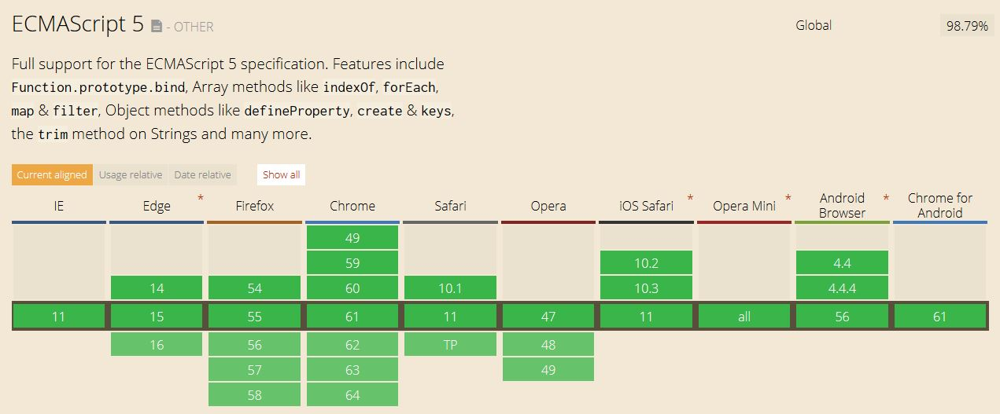

# Linq-Collections: (IEnumerable, ...) + (List, Dictionary, ...)

[](https://npmjs.org/package/linq-collections)
[](https://npmjs.org/package/linq-collections)
[](https://npmjs.org/package/linq-collections)
[](https://travis-ci.org/isc30/linq-collections)
[](https://snyk.io/test/github/isc30/linq-collections)
[](https://coveralls.io/github/isc30/linq-collections?branch=master)
[](https://isc30.github.io/linq-collections/mocha)
<!-- [](https://npmjs.org/package/linq-collections) -->

Strongly typed *Linq* implementation for *Javascript* and *TypeScript* (*ES5*, *ES6*, +)<br />
Includes collections (+ readonly versions): List, Dictionary, Stack, ...

##  Under active development
https://github.com/isc30/linq-collections<br/>
This project is activelly being developed and improved by Ivan Sanz (isc30)<br />

Please expect some missing features until it's finished. [Development status and missing features list](https://github.com/isc30/linq-collections/projects/1)<br/>
If you want to contribute, open an issue explaining your feature and I will be happy to accept pull requests :D

[](https://isc30.github.io/linq-collections/mocha)

## Intellisense friendly
Every single method has **complete** type definitions available.<br />
If you use TypeScript, its purely is based in **generics**.<br /><br />
[Insert motivational GIF with intellisense in action]

## Browser compatibility: 100%
Using **ES5**, it has **100% compatibility** with nodejs and all main browsers (+mobile)<br/>
Check your browser now if you don't believe it -> [](https://isc30.github.io/linq-collections/mocha)

[](assets/compatibility.jpg)

## Performance
*Linq-Collections* uses custom **iterators** and **deferred execution** mechanisms that ensure **BLAZING FAST** operations, outperforming any other popular library. Its also optimized to work with **minimal CPU and RAM usage**.

## Why use it?
If previous reasons aren't enought, here are few more:
- **Javascript && TypeScript compatible** - You can use it with JS or TypeScript (contains .d.ts definitions)
- **No dependencies** - Pure and lightweight
- **100% browser/nodejs support** - Stop caring about compatibility, it works everywhere!
- **Strongly typed** - Developed in TypeScript, it uses no 'any' or dirty code. Everything is based in generics and strongly typed
- **Best performance** - Deferred execution with custom iterators make the difference. Currently the fastest library.
- **Works out of the box** - *'npm install linq-collections'* is the hardest thing you'll need to do
- **Collections** - Provides many type of collections (list, dictionary, ... + readonly) with linq integrated inside. As in C#
- **Strict standard** - Strictly implementing [microsoft's official linq definition](https://docs.microsoft.com/en-us/dotnet/csharp/programming-guide/concepts/linq/classification-of-standard-query-operators-by-manner-of-execution) (you can check it for exceptions, behavior, etc)
- **Deeply tested** - Each new version is passing tons of quality tests before being released

## Using the package
Interfaces for this library are already designed. New versions won't break any old code.
We strongly recommend using `*` for version selector
```json
dependencies {
    "linq-collections": "*"
}
```

## Features
Complete **Linq to Objects** implementation (deferred execution)
> toArray, toList, toDictionary, toLookup, aggregate, all, any, average, concat, contains, count, defaultIfEmpty, distinct, elementAt, elementAtOrDefault, except, first, firstOrDefault, forEach, groupBy, groupJoin, intersect, join, last, lastOrDefault, longCount, max, min, orderBy, orderByDescending, reverse, select, selectMany, sequenceEquals, single, single, singleOrDefault, skip, skipWhile, sum, take, takeWhile, union, where, zip, ...

Collections (+ readonly versions)
> List, Dictionary, Stack, Queue, ...

All Collections are **Queryable**
```typescript
const list = new List<string>([
    "Hello",
    "Bye",
    "Thanks",
]);

const notHello = list.where(e => e !== "Hello");
```

## How to run tests
This library uses `mocha` with custom assertion helper for testing.<br />
Use `nyc mocha` to run the tests and coverage.

## Hall of fame
* [@nikolalukovic](https://github.com/nikolalukovic)
